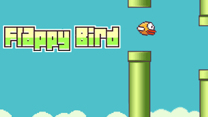

# Flappy-Bird-Game

A Famous  i-phone game Flappy Bird Created Using Unity Engine 

## Working Tools Required:-
 </a> Unity Hub 
 
</a>Visual Studio            
## Download & Play the game Over Here:-
[Download!](https://github.com/Shinjan-saha/Flappy-Bird-Game/blob/main/flappybird12.exe)

## Working Environment In Unity

## Working Environment in Microsoft Visual Studio

## The Structure Of the project:-

Structure of this hireachy project must be done this way only

## Setting In Unity:-
The Setting in Unity Must Be changed In each & Every Layer properly following are the Snapshot given for each Frame follow them Properly See which Script is going to Which frame properly

## Main camera  

## Bird

## Pipe Spawner

## Canvas

## Event System

## Logic Manager

